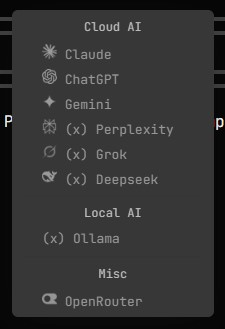

# INCOMPLETE / NOT WORKING

### Monochrome-switcher

<p> An app that lets the users mix-and-match different kinds of agents/AI either local or Cloud AIs. These agents/AIs are integrated into a panel to which it can support up to 5 agents/AIs at once. </p>

### Features

- Switch between multiple AI or Agents seamlessly
- API Based Authentication
- Cross-platform
- OpenRouter integration
- Support for local LLMs (x)

### Screenshots

#### AI Selection



for the symbols, please refer to the [AI/Agents section](#aiagents)

#### Multi-Agent Chat

#### Settings

### Demo

### Installation

<p> Clone the repository: </p>

```
git clone https://github.com/Luc1l1us/monochrome-switcher.git
```

For Linux:

```
cd install-scripts
bash install.sh
```

If it does not work, try chmod:

```
chmod +x install.sh
```

and run:

```
./install.sh
```

### To run

<p> To run rails: </p>

```
cd rails-frontend
wails dev
```

<p> To run Aylur's GTK Shell (AGS): </p>

```
ags run
```

<p> To run backend: </p>

```
cd backend
go run .
```

### Inputting API Keys

<p> To manually input API Keys, locate the UserConfig Folder (see below) and edit these in: </p>

```
"claude_key" = [insert api token here]
"chatgpt_key" = [insert api token here]
"gemini_key" = [insert api token here]
and much more
```

### User Configuration

<p> To view or edit the settings.json file, here are the location for each operating system: </p>

#### Windows

```
C:\Users\[UserName]\AppData\Roaming\monochrome-switcher\settings.json
```

#### MacOS

```
~/Library/Application Support/monochrome-switcher/settings.json
```

#### Linux

```
~/.config/monochrome-switcher/settings.json
```

<p> replace [UserName] with your own desktop's username </p>

### AI/Agents

```
(✓) mark for AI Agents that are implemented
(!) mark for AI Agents that require a subscription to access
(x) mark for AI Agents that haven't been implemented yet

(✓) Gemini
(✓) ChatGPT
(✓) Claude
(x) Perplexity
(x) DeepSeek
(x) Grok
(x) Synthesia
(x) Ollama
(✓) OpenRouter
```

### Goals

```
Concurrency
Add RAG functionality
```

### Tech Stack

```
Aylur's GTK Shell
Wails
GOlang
```
